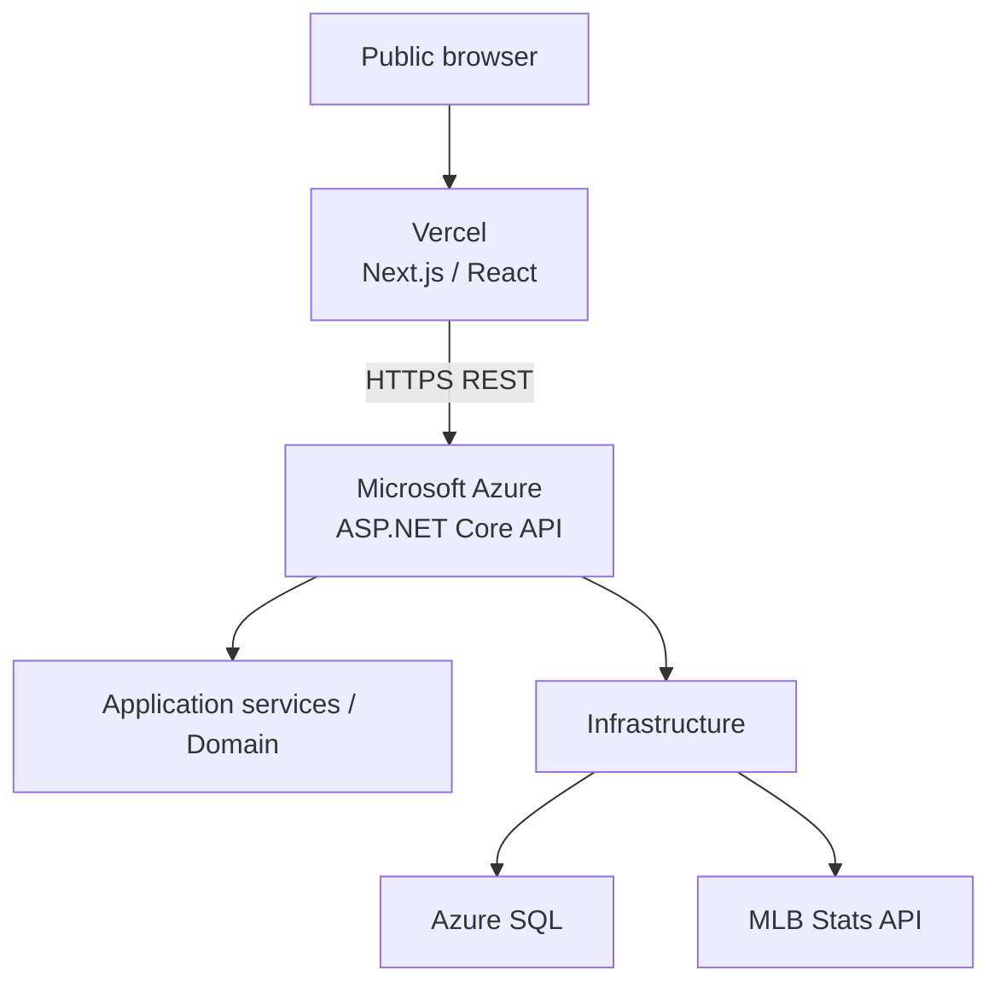
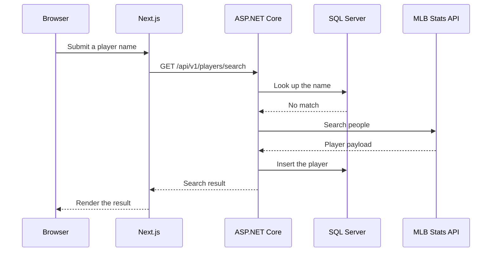
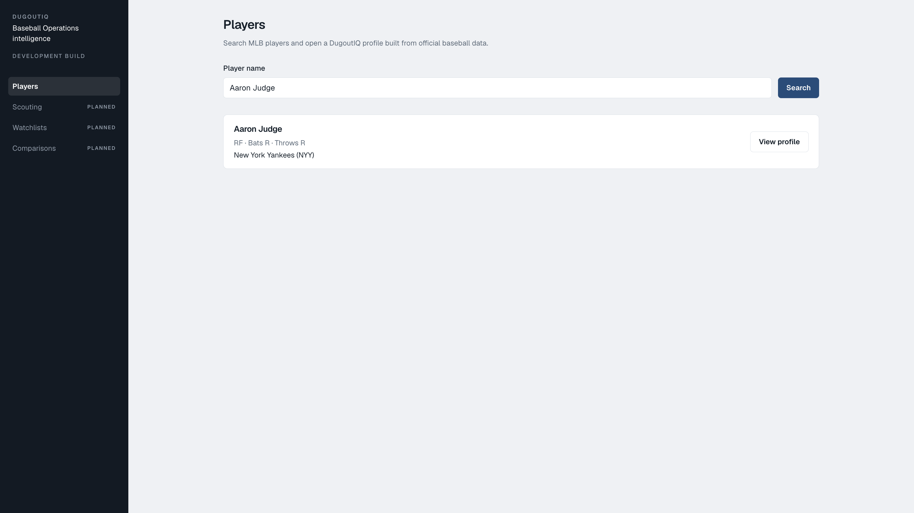
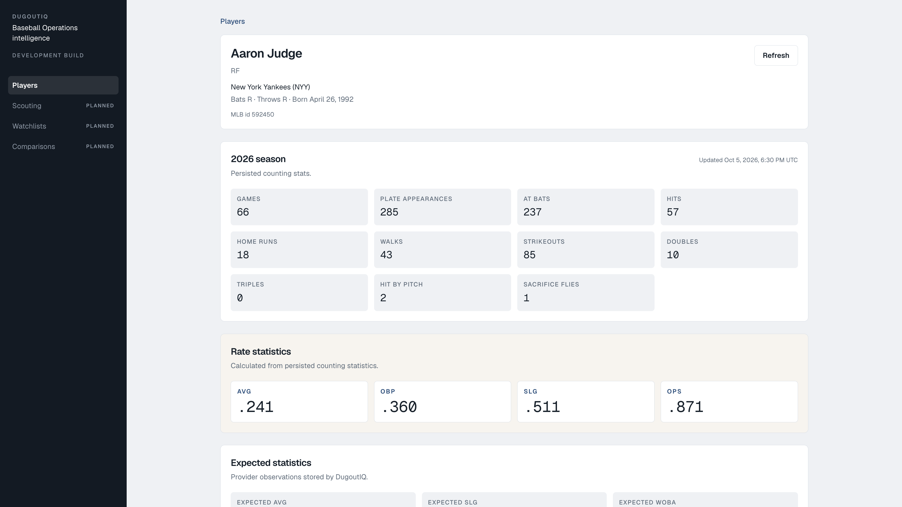

# DugoutIQ

Baseball Operations intelligence platform built with ASP.NET Core, C#, SQL Server, Entity Framework Core, Next.js, React, and TypeScript.

Source: [github.com/miltonisblurrd/DugoutIQMLB](https://github.com/miltonisblurrd/DugoutIQMLB)

DugoutIQ is an engineering portfolio project. It is not affiliated with MLB or any club.

## Live Demo

Frontend: [dugoutiq-nu.vercel.app](https://dugoutiq-nu.vercel.app)

The Next.js app is deployed on Vercel. Search and profile on that site stay empty until the Azure API is deployed and `NEXT_PUBLIC_DUGOUTIQ_API_URL` is set to that API. No database credentials are stored in Vercel.

## Overview

Front offices search for players, keep a durable record, and separate official counting stats from rates the application calculates itself. DugoutIQ is a small version of that workflow: search a player, persist the identity in SQL Server, and open a profile that shows the season, DugoutIQ-calculated rates, and the expected statistics the provider actually returned.

The browser talks only to the DugoutIQ API. Next.js does not call MLB, and it does not recalculate AVG, OBP, SLG, or OPS.

## Current Features

- MLB player search through the DugoutIQ API
- Persistent player profiles stored in SQL Server
- Local-first search: a later search for a stored name is answered from SQL
- Player, team, and season persistence
- Counting statistics, including hit-by-pitch and sacrifice flies
- AVG, OBP, SLG, and OPS calculated in the C# domain
- Expected batting average, expected slugging, and expected wOBA when the provider returns them
- Responsive search and profile UI
- ProblemDetails responses for validation and not-found errors
- Automated tests for domain math, provider mapping, orchestration, and API errors

Scouting, watchlists, comparisons, authentication, and background jobs are not implemented. The sidebar marks those modules as planned.

## Architecture

Production is designed as three deployed parts. Local development uses the same application code with SQL Server 2022 in Docker instead of Azure SQL.



| Layer | Responsibility |
|---|---|
| Next.js | Search and profile screens. Server state uses TanStack Query. JSON is checked with Zod. |
| ASP.NET Core | HTTP, ProblemDetails, Swagger, health, and CORS. |
| Application | Search and profile use cases. No MLB JSON types. |
| Domain | Player, team, season, and rate rules. No database or HTTP. |
| Infrastructure | EF Core, SQL Server, and the MLB Stats API client. |
| SQL Server | Local Docker container, or Azure SQL in production. |

## Request Flow

A first search misses in SQL, so the API asks MLB, normalizes the result, and stores it.



A later search for that same name stops after the SQL hit. The MLB client is not called.

Opening a profile is a separate request. If the current season is missing or stale, the API loads the person, team, season counting stats, and expected statistics, then saves that graph. Rate stats are calculated from the stored counts when the profile is mapped. They are not columns in `PlayerSeasons`.

## Tech Stack

**Backend**

- C#
- .NET 10
- ASP.NET Core
- Entity Framework Core
- SQL Server
- Serilog
- Swagger / OpenAPI
- xUnit

**Frontend**

- Next.js
- React
- TypeScript
- Tailwind CSS
- TanStack Query
- Zod

**Infrastructure and delivery**

- Docker, for local SQL Server 2022
- Git and GitHub
- GitHub Actions for build and test
- Vercel hosts the frontend at [dugoutiq-nu.vercel.app](https://dugoutiq-nu.vercel.app)
- Azure App Service and Azure SQL are the chosen backend. They are not provisioned yet.

## Domain Decisions

Counting stats are facts from the provider, so they are stored. AVG, OBP, SLG, and OPS are functions of those counts, so the domain calculates them and the database does not store them. A zero-at-bat season has no average. That is null, not `.000`.

MLB JSON shapes stay in Infrastructure. Application code depends on a provider interface, so a different feed can replace the client without changing the domain.

`CancellationToken` is passed through the controller, the application service, the repository, and the HTTP client.

Search is local-first. If SQL already has a match, the provider is not called. The tradeoff is that one stored similar name can hide other MLB matches.

Errors become ProblemDetails in one exception handler. Validation is 400. A missing player is 404. Unexpected failures do not return the connection string or a stack trace.

Search queries use `AsNoTracking` because they only display rows. Profile loads are tracked because enrichment updates the player, team, and season in one `SaveChanges`.

## Baseball Calculation Example

The domain calculates:

```text
AVG = H / AB
OBP = (H + BB + HBP) / (AB + BB + HBP + SF)
SLG = TB / AB
OPS = OBP + SLG
```

Total bases are `H + 2B + 2×3B + 3×HR`. Each rate is rounded to three decimal places, midpoint away from zero, before OPS is the sum of the rounded OBP and SLG. React prints the numbers the API returns.

## Testing

`dotnet test DugoutIQ.slnx` currently runs 36 tests: 36 passed, 0 failed, 0 skipped.

| Area | What it covers |
|---|---|
| Domain | AVG, OBP, SLG, and OPS, including a zero denominator |
| Provider fixtures | Captured MLB JSON mapped without a live network call |
| Application | Local hit, provider miss, failure, and cancellation |
| API | ProblemDetails for validation and other handled failures |

GitHub Actions runs the same build and test commands. CI does not need SQL Server or the live MLB API.

## Local Development

Install the .NET 10 SDK, Node.js 20, and Docker Desktop. SQL Server's container image is `linux/amd64`. Docker Desktop runs it on Apple Silicon through emulation.

From the repository root, copy the example environment and set a local SA password. Do not commit that file.

```bash
cp .env.example .env
```

Start SQL Server:

```bash
docker compose up -d
```

Load the environment, restore the local EF tool, and apply the migration. The password stays in `.env`.

```bash
set -a
source .env
set +a
dotnet tool restore
dotnet tool run dotnet-ef database update \
  --project src/DugoutIQ.Infrastructure \
  --startup-project src/DugoutIQ.Infrastructure
```

Start the API:

```bash
dotnet run --project src/DugoutIQ.Api --launch-profile http
```

The API listens at `http://localhost:5080`. Health is `GET /api/v1/health`. Swagger is `/swagger` in Development.

Start the frontend:

```bash
cd web
cp .env.example .env.local
npm install
npm run dev
```

Open `http://localhost:3000`. `NEXT_PUBLIC_DUGOUTIQ_API_URL` is a public browser setting. It must be the API origin only, never a connection string or password.

Production CORS origins are empty until they are set with `Cors__Origins__0`. Development allows `http://localhost:3000` and `http://127.0.0.1:3000`.

`Database:ApplyMigrationsOnStartup` is false. Apply migrations with `dotnet ef`, including in production. Do not turn on startup migration unless that choice is reviewed.

## Screenshots





## Known Limitations

- A stored name match is returned without asking MLB, so a similar name already in SQL can hide other players.
- The MLB Stats API client does not supply exit velocity, barrel rate, hard-hit rate, launch angle, whiff rate, or chase rate. Those fields stay null instead of becoming fake zeros.
- There is no authentication or authorization.
- The working product is player search and player profile.
- Scouting, watchlists, and comparisons are visible only as planned navigation.

## Roadmap

Not built yet:

- Scouting reports
- Watchlists
- Player comparison
- Trend analysis
- Decision signals
- Authentication and roles
- Background refresh
- Cloud observability beyond the API health check

## Deployment

| Piece | Target |
|---|---|
| Repository | [GitHub](https://github.com/miltonisblurrd/DugoutIQMLB) |
| Frontend | Vercel, with the project root set to `web` |
| Backend | Azure App Service, ASP.NET Core only |
| Production database | Azure SQL |
| Local database | SQL Server 2022 in Docker |

The ASP.NET Core API is not deployed to Vercel. Vercel receives `NEXT_PUBLIC_DUGOUTIQ_API_URL` and no database secrets. That variable is unset until the Azure API URL exists. Azure will read `ConnectionStrings__DugoutIQ` and `Cors__Origins__0` from application settings. The schema is the EF migration `20260929200100_InitialCreate`, applied deliberately rather than on every process start.

The frontend production URL is [https://dugoutiq-nu.vercel.app](https://dugoutiq-nu.vercel.app). Azure App Service and Azure SQL are not provisioned yet.
